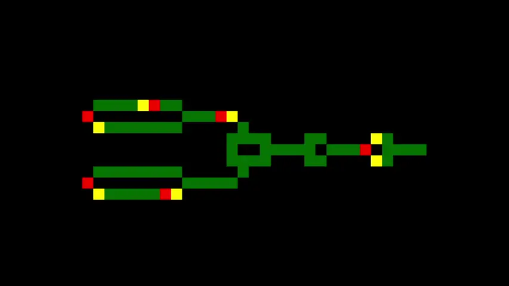

# Wireworld.v
V language implementation of [Wireworld](https://en.wikipedia.org/wiki/Wireworld)

# Controls
| Function | Key |
| - | - |
| Pause | `p` |
| Step (while paused) | `space` |
| Toggle Grid | `g` |
| Clear Grid | `c` |
| Save Map | `s` |
| Place Connection | `left click` |
| Cycle Electron Type | `right click` |

